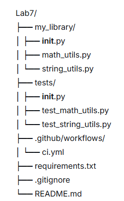
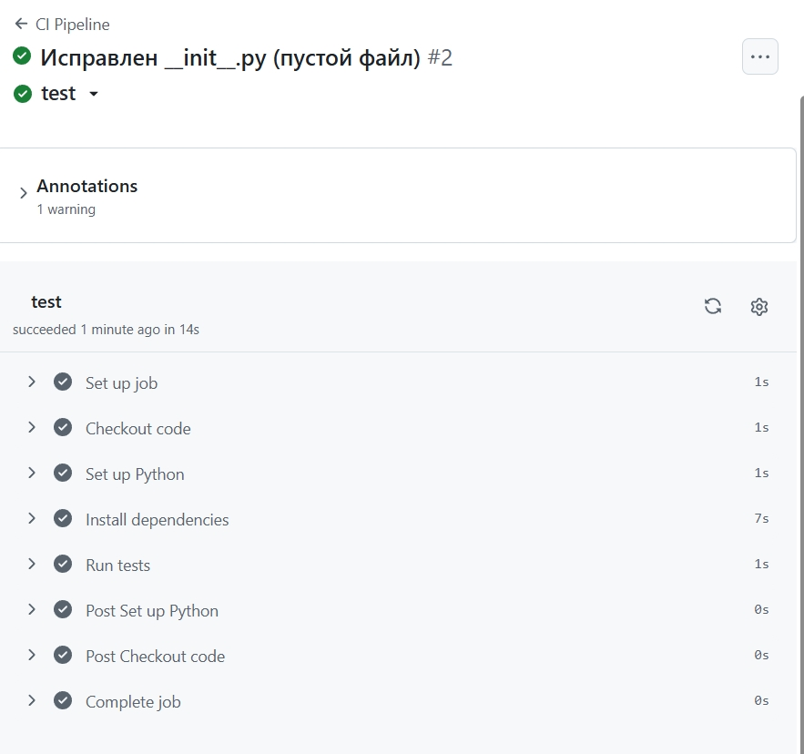
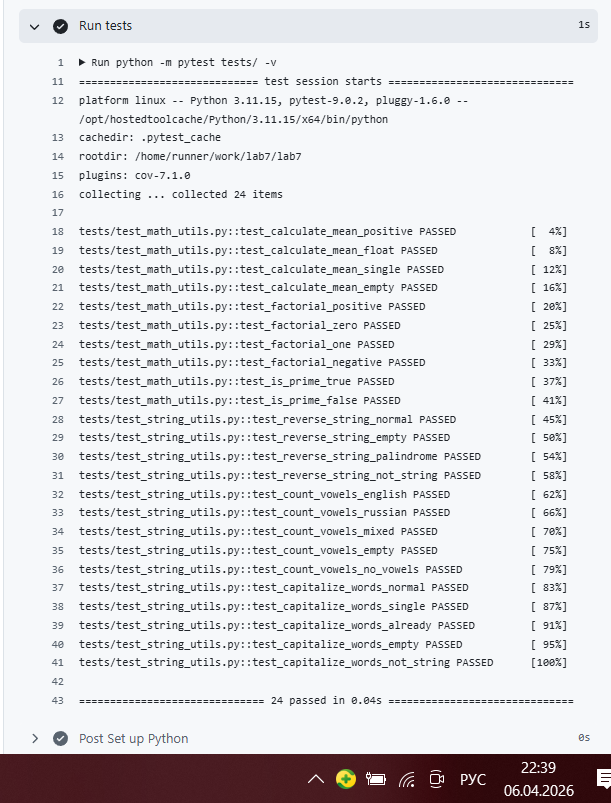
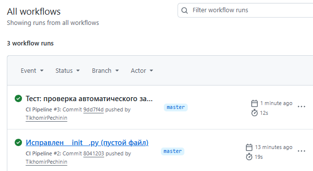
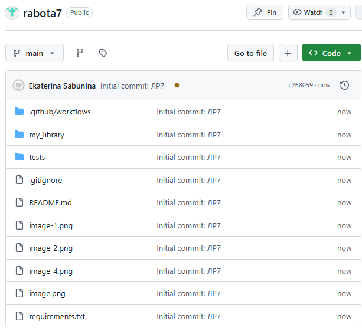

# Отчёт по лабораторной работе №7

**Дисциплина:** Разработка инструментального программного обеспечения  
**Тема:** Настройка CI/CD для автоматической сборки и тестирования библиотеки  
**Выполнила:** Екатерина Сабынина  
**Группа:** 222  
Репозиторий: https://github.com/EkaterinaSabunina/rabota7
---

## 1. Цель работы

Научиться настраивать систему непрерывной интеграции и доставки (CI/CD) для автоматизации процессов сборки, тестирования и публикации инструментальной библиотеки.

---

## 2. Задачи работы

- Подготовить проект с библиотекой и тестами
- Загрузить проект в удалённый репозиторий GitHub
- Настроить автоматическую сборку и запуск тестов при каждом коммите
- Проверить работу CI/CD-пайплайна
- Оформить результаты в виде отчёта

---

## 3. Выполненные операции

### 3.1 Подготовка проекта

Для работы взят проект из лабораторной работы №6. Проект включает библиотеку `my_library` с шестью функциями и набор тестов pytest.

**Структура проекта:**



### 3.2 Создание репозитория на GitHub

Создан репозиторий с именем `rabota7` по адресу: `https://github.com/EkaterinaSabunina/rabota7`

### 3.3 Настройка GitHub Actions

Создан файл `.github/workflows/ci.yml` с настройками CI/CD пайплайна.

**Содержимое файла `ci.yml`:**
```yaml
name: CI Pipeline

on:
  push:
    branches: [ master, main ]

jobs:
  test:
    runs-on: ubuntu-latest
    
    steps:
    - name: Checkout code
      uses: actions/checkout@v4
    
    - name: Set up Python
      uses: actions/setup-python@v5
      with:
        python-version: '3.11'
    
    - name: Install dependencies
      run: |
        python -m pip install --upgrade pip
        pip install -r requirements.txt
    
    - name: Run tests
      run: |
        python -m pytest tests/ -v
```
Функции пайплайна:

Автоматический запуск при каждом push в ветки master или main

Загрузка кода из репозитория

Установка Python версии 3.11

Установка зависимостей из requirements.txt (pytest, pytest-cov)

Запуск всех тестов с подробным выводом

3.4 Запуск пайплайна
После отправки кода на GitHub Actions автоматически запустил выполнение всех этапов.

Скриншот успешного выполнения пайплайна: 



Скриншот логов выполнения: 



### 3.5 Проверка автоматического запуска
При последующем изменении кода (добавлении комментария в README) пайплайн запустился автоматически без ручного вмешательства и успешно прошёл.

Скриншот истории запусков:



Репозиторий: https://github.com/EkaterinaSabunina/rabota7


## 4. Выводы
Преимущества автоматизации:

Автоматический запуск тестов — после каждого изменения код проверяется без участия человека

Быстрое обнаружение ошибок — проблема находится сразу после коммита, а не перед релизом

Экономия времени — разработчик не тратит время на ручной запуск тестов

Сохранение истории проверок — все запуски сохраняются, можно отследить момент поломки

Почему CI/CD важен при разработке ИПО:

Качество кода — автоматическая проверка гарантирует, что новые изменения не ломают существующий функционал

Надёжность — снижается риск попадания ошибок в готовый продукт

Скорость разработки — отпадает необходимость каждый раз вручную запускать тесты

Командная работа — все изменения проверяются одинаково, независимо от автора

Возможные улучшения системы:

Добавить автоматическую публикацию библиотеки на PyPI при создании тега

Добавить проверку стиля кода (flake8, black, pylint)

Добавить автоматическую генерацию документации через Sphinx

Добавить отправку уведомлений в Telegram о результатах запуска

Настроить кэширование зависимостей для ускорения сборки

## 5. Заключение
Лабораторная работа выполнена полностью. Настроен CI/CD пайплайн с использованием GitHub Actions. При каждом push в репозиторий автоматически запускаются тесты, что позволяет быстро обнаруживать ошибки и поддерживать качество кода на высоком уровне.
